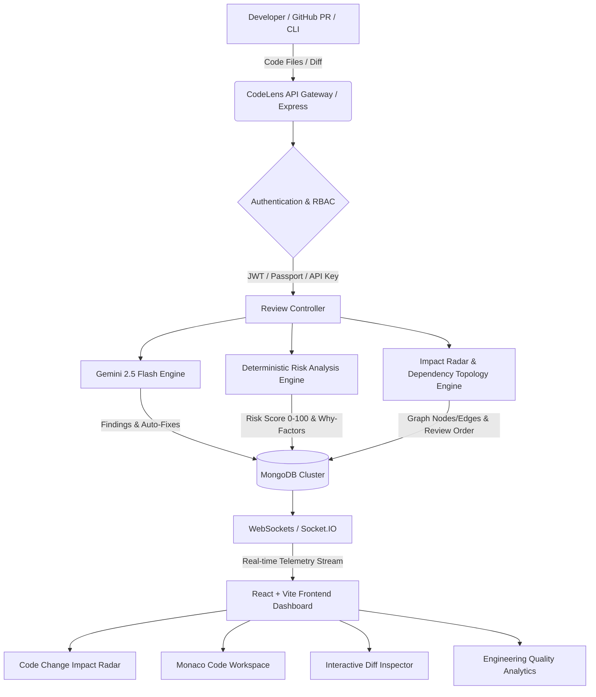

<div align="center">

# 🛰️ CodeLens — Intelligent Code Review & Change Impact Radar Platform

[](https://github.com)
[](https://github.com)
[](https://www.docker.com)
[](https://mongodb.com)
[](https://aistudio.google.com)
[](LICENSE)

**An enterprise-grade code review intelligence platform that doesn't just ask *"What is wrong?"* but answers *"How dangerous is this change?"*, *"What modules could this break?"*, and *"Which files should be reviewed first?"***

</div>

---

## 🌟 The MNC Placement Pitch: Why CodeLens Stands Out

Traditional automated review bots (like standard SonarQube or basic AI linters) produce a flat list of disconnected errors. In real-world enterprise codebases (Google, Microsoft, Amazon, Meta), senior engineers and staff reviewers don't review files randomly—they calculate **blast radius**, **dependency topology**, and **system risk**.

**CodeLens bridges this gap with its signature architecture:**
1. **Deterministic Risk Scoring (0–100)**: Combines static AST complexity, security findings, change size, and historical regression flakiness into an explainable metric with clear *"Why?"* reasoning.
2. **Code Change Impact Radar**: Dynamically builds an interactive dependency graph of touched modules, mapping imports, callers, and downstream blast radius.
3. **Topological Review Prioritization**: Automatically computes the optimal file review order (`FIRST`, `SECOND`, `THIRD`), ensuring reviewers audit foundational/critical components before dependent layers.
4. **Real GitHub Pull Request Workflows**: Inspects live repository branches, PR diffs, and provides unified/split multi-file diff inspection.
5. **Developer Skill Growth Telemetry**: Aggregates real MongoDB audit findings over time without hallucinated data, pinpointing recurring weaknesses and offering targeted learning pathways.

---

## 🏛️ System Architecture



---

## 🚀 Key Features

### 1. 🛰️ Signature Feature: Code Change Impact Radar
- **Visual Dependency Topology**: Generates an interactive SVG module graph with pulsating risk badges (`CRITICAL`, `HIGH`, `MEDIUM`, `LOW`).
- **Blast Radius Analysis**: Highlights which downstream services and modules are affected by touched interfaces.
- **Explainable Review Ordering**: Topologically sorts files to advise reviewers which file to inspect first with concrete natural-language rationales.

### 2. 🛡️ Deterministic Risk Engine (`riskAnalysisService.js`)
- Risk score calculated deterministically:
  $$\text{Risk Score} = \text{Security} (0\text{--}30) + \text{Complexity} (0\text{--}25) + \text{File Impact} (0\text{--}20) + \text{Change Size} (0\text{--}15) + \text{History} (0\text{--}10)$$
- Provides a detailed breakdown table and clear *"Why is this pull request risky?"* bullet points.

### 3. 🐙 Real GitHub Pull Request Integration
- Connect GitHub via OAuth or Personal Access Token (PAT).
- Search repositories, browse open Pull Requests, and trigger one-click comprehensive audits with patch extraction.

### 4. 📊 Engineering Quality & Code Health Dashboard
- 5 Core Health Indices: **Overall Quality**, **Review Risk**, **Security Shield**, **Maintainability**, and **Performance**.
- Real-time severity counters (Critical, High, Medium, Low, Info).
- Recent reviews telemetry table with direct workspace navigation.
- Top risky modules watchlist and chronological developer trend charts.

### 5. 💻 Professional Monaco Code Workspace
- Integrated Monaco Editor matching VS Code & GitHub dark theme.
- Inline diagnostic squiggles, issue focus jump, and AI recommendation widgets.
- **One-Click Quick Fix**: Live before/after diff preview modal with resolution tracking that strictly preserves original issue categories and severities.

### 6. ⚖️ Interactive Diff Inspector
- Side-by-side (Split) and Unified diff viewer (`react-diff-viewer-continued`).
- Multi-file tab selector for GitHub PR audits with line addition/deletion counters (`+X / -Y`).

### 7. 🤖 Contextual AI Streaming & Developer Utilities
- **Gemini Chat Follow-up**: Real-time WebSocket streaming of developer questions.
- **Unit Test Suggester**: Automatically generates test suites targeting identified edge cases.
- **Comment & String Translator**: Translates non-English inline documentation into clean English.
- **PDF & Markdown Report Exporters**: 1-click downloadable audit reports.

---

## 🛠️ Technology Stack

| Layer | Technologies |
|---|---|
| **Frontend** | React 18, Vite 5, Tailwind CSS, Monaco Editor, React Router v6, Recharts, Zustand, Socket.IO Client, Lucide Icons |
| **Backend** | Node.js, Express.js, MongoDB, Mongoose, JWT, Passport.js (GitHub OAuth), Helmet, Express Rate Limit, Multer, PDFKit |
| **AI Engine** | Google Gemini API (`@google/genai` 2.5 Flash SDK) |
| **Testing** | Jest, Supertest (15/15 deterministic unit and edge case tests) |
| **DevOps** | Docker, Docker Compose, Nginx, GitHub Actions CI/CD Pipeline |

---

## ⚡ Quick Start & Installation

### Option A: Docker Compose (Recommended)

1. Clone the repository and configure your environment:
   ```bash
   git clone https://github.com/yourusername/codelens.git
   cd codelens
   ```

2. Create a `.env` file in the root directory (or use `server/.env.example` as a template):
   ```env
   GEMINI_API_KEY=your_gemini_api_key_from_google_ai_studio
   JWT_SECRET=your_super_secret_jwt_key
   ```

3. Launch all microservices:
   ```bash
   docker-compose up --build
   ```

4. Access CodeLens:
   - **Frontend App**: [http://localhost](http://localhost) (Port 80)
   - **Backend API**: [http://localhost:5000](http://localhost:5000)
   - **MongoDB**: `localhost:27017`

---

### Option B: Local Development

#### Prerequisites
- Node.js (v18+)
- MongoDB Community Server running locally on `mongodb://127.0.0.1:27017/codelens`
- Google Gemini API Key ([Google AI Studio](https://aistudio.google.com/))

#### 1. Setup Server
```bash
cd server
npm install
cp .env.example .env
# Add your GEMINI_API_KEY in server/.env
npm run dev
```

#### 2. Setup Client
```bash
cd ../client
npm install
npm run dev
```
Open [http://localhost:5173](http://localhost:5173) in your browser.

---

## 🧪 Running Automated Tests

CodeLens includes a complete automated test suite covering deterministic risk algorithms, dependency graph extraction, issue resolution integrity, and boundary edge cases:

```bash
cd server
npm test
```

**Test Suite Coverage:**
- ✅ `tests/riskAnalysis.test.js`: AST complexity estimation, multi-language imports (JS/TS, Python, Java, Go), 0–100 risk score clamping, and Impact Radar review order sorting.
- ✅ `tests/findingResolution.test.js`: Status resolution toggling with strict category and severity preservation.
- ✅ `tests/edgeCases.test.js`: Defensive fallbacks for empty files, syntax errors, large diffs (>1000 LOC), and zero-finding clean code.

---

## 📡 REST API Reference Summary

| Method | Endpoint | Description |
|---|---|---|
| `POST` | `/api/auth/register` | Register new engineer account |
| `POST` | `/api/auth/login` | Authenticate user & return JWT |
| `GET` | `/api/analytics/dashboard` | Aggregated Code Health & recent review telemetry |
| `GET` | `/api/analytics/recurring-issues` | Top repeated mistakes across MongoDB history |
| `POST` | `/api/reviews/analyze` | Run audit on pasted code with Impact Radar & Risk |
| `POST` | `/api/reviews/upload` | Upload & audit source code file |
| `POST` | `/api/reviews/analyze-batch` | Multi-file cross-module dependency audit |
| `POST` | `/api/reviews/analyze-pr` | Audit GitHub Pull Request with patch analysis |
| `GET` | `/api/reviews/:id/risk` | Get deterministic risk breakdown for review |
| `GET` | `/api/reviews/:id/impact` | Get dependency topology & review order |
| `PUT` | `/api/reviews/:id/findings/:findingId/resolve` | Toggle issue resolution state |
| `PUT` | `/api/reviews/:id/apply-fix` | Apply AI quick fix and update code |
| `POST` | `/api/github/link-pat` | Link GitHub Personal Access Token |
| `GET` | `/api/github/repos` | List user's GitHub repositories |
| `GET` | `/api/github/pulls/:owner/:repo` | List open Pull Requests |

---

## 💼 MNC Interview Talking Points (How to Pitch This Project)

### 1. "What makes this project different from existing linters or AI wrappers?"
> *"Most tools simply query an LLM for syntax errors. CodeLens is an engineering risk platform. It features a custom deterministic risk engine (`riskAnalysisService.js`) that analyzes AST complexity, module coupling, change volume, and historical regression flakiness to output an explainable 0–100 risk score. It also generates an interactive dependency topology (Code Change Impact Radar) that tells reviewers which files to audit first based on blast radius."*

### 2. "How does the Code Change Impact Radar compute review order?"
> *"It parses imports across JavaScript, TypeScript, Python, Java, and Go, then models the changeset as a directed dependency graph. It performs a multi-criteria topological priority sort combining critical security findings, downstream dependent count (core services audited before consumers), and change magnitude. This mirrors how Staff Engineers conduct architectural code reviews."*

### 3. "How did you ensure security and enterprise readiness?"
> *"We implemented dynamic origin-validated CORS supporting `CLIENT_URL` whitelisting, HTTP security headers via Helmet, Express Rate Limiting (1500 req/15min) against brute-force attacks, bcryptjs password hashing with salt rounds, JWT verification middleware, Docker containerization with Nginx reverse proxying, and a GitHub Actions CI pipeline running unit tests on every PR."*

---

## 📄 License

This project is licensed under the MIT License - see the [LICENSE](LICENSE) file for details.
